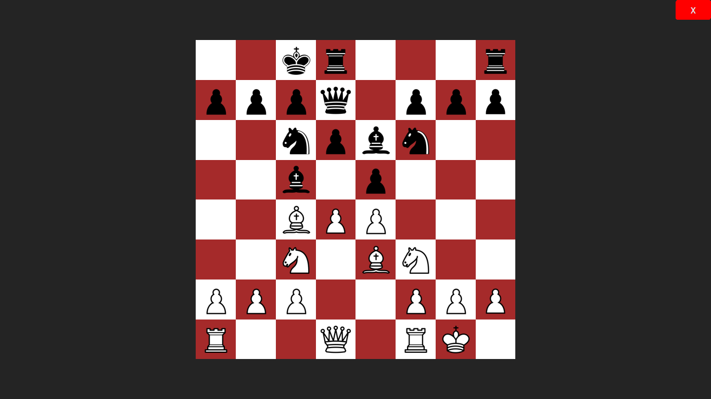
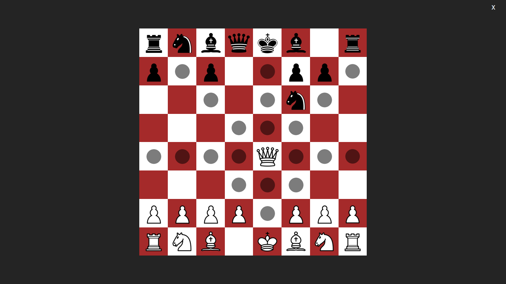
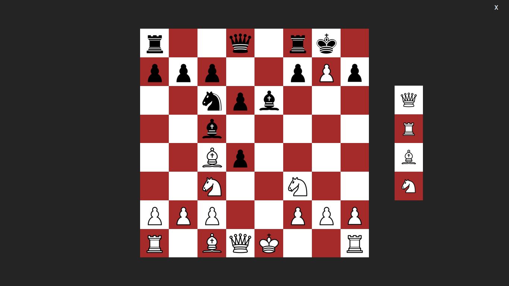

<div align="center">

# ♟️ Python Chess Game

### *A fully-featured chess implementation with beautiful UI and complete rule validation*

[](https://www.python.org/)
[](LICENSE)
[](https://github.com/your-username/python-chess-game)



[Features](#-features) • [Demo](#-demo) • [Installation](#-installation) • [How to Play](#-how-to-play) • [Architecture](#%EF%B8%8F-architecture) • [Roadmap](#%EF%B8%8F-roadmap)

</div>

---

## ✨ Features

<table>
<tr>
<td width="50%">

### 🎯 Complete Chess Rules
All standard chess rules faithfully implemented, including:
- Piece movement validation
- Turn-based gameplay
- Capture mechanics

</td>
<td width="50%">

### 👁️ Visual Move Indicators
See all legal moves highlighted in real-time with elegant dot overlays on valid squares.

</td>
</tr>
<tr>
<td width="50%">

### 🏁 Endgame Detection
Automatic detection of:
- ✓ Checkmate
- ✓ Stalemate
- ✓ Check warnings

</td>
<td width="50%">

### ⚡ Special Moves
Full support for advanced chess mechanics:
- Castling (kingside & queenside)
- En passant captures
- Pawn promotion with piece selection

</td>
</tr>
<tr>
<td width="50%">

### 📐 Responsive Design
- Fullscreen mode (ESC to toggle)
- Dynamic board resizing
- Optimized rendering performance

</td>
<td width="50%">

### 💾 Game Persistence
- Save game state automatically
- Resume games anytime
- JSON-based storage

</td>
</tr>
</table>

---

## 🎥 Demo

<div align="center">

### Gameplay Preview

| 🎮 Main Board | 🎯 Legal Moves | 👑 Pawn Promotion |
|:---:|:---:|:---:|
|  |  |  |

<!-- ### Live Gameplay -->
<!--  -->

</div>

---

## 🚀 Installation

### Prerequisites

Before you begin, ensure you have:
- **Python 3.14+** installed ([Download here](https://www.python.org/downloads/))
- **pip** package manager

### Step-by-Step Setup

1️⃣ **Clone the repository**
```bash
git clone https://github.com/your-username/python-chess-game.git
cd python-chess-game
```

2️⃣ **Install dependencies**
```bash
pip install customtkinter pillow numpy
```

3️⃣ **Run the game**
```bash
python chess.py
```

> 💡 **Tip:** For the best experience, run in fullscreen mode (press `ESC` after launching)

---

## 🎮 How to Play

### 🕹️ Controls

| Action | Control |
|--------|---------|
| Select a piece | Left click on piece |
| Move piece | Left click on highlighted square |
| Toggle fullscreen | `ESC` key |
| Close game | Click **×** button or `Alt+F4` |

### ♟️ Special Moves Guide

<details>
<summary><b>🏰 Castling</b></summary>

- King and rook must not have moved
- No pieces between them
- King not in check, not moving through check
- **How:** Click king, then click two squares toward the rook

</details>

<details>
<summary><b>⚔️ En Passant</b></summary>

- Available when opponent's pawn moves two squares forward
- Must be captured immediately on next turn
- **How:** Move your pawn diagonally to the square behind the opponent's pawn

</details>

<details>
<summary><b>👑 Pawn Promotion</b></summary>

- Occurs when pawn reaches the opposite end
- **How:** Move pawn to last rank, then select Queen, Rook, Bishop, or Knight from the panel

</details>

### 📚 New to Chess?

Learn the complete rules at [Chess.com](https://www.chess.com/learn-how-to-play-chess)

---

## 🏗️ Architecture

### 📂 Project Structure

```
python-chess-game/
│
├── chess.py              # 🎨 GUI & User Interaction Layer
├── utils.py              # 🧠 Chess Engine & Move Logic
├── database/
│   ├── database.py       # 💾 Game State Management
│   └── matrix.json       # 📊 Saved game data
└── images/               # 🖼️ Chess piece assets
    ├── white/
    └── black/
```

### 🔄 Data Flow

```
User Click → GUI (chess.py) → Validate Move (utils.py) → Update State (database.py) → Render UI
```

### 🎯 Design Principles

- **Separation of Concerns**: UI, logic, and state are cleanly separated
- **Stateless Rendering**: All UI is derived from central game state
- **Performance Optimized**: LRU caching, debounced redraws, hash-based change detection

---

## ⚙️ Technical Details

<details>
<summary><b>🛠️ Tech Stack</b></summary>

| Technology | Purpose |
|------------|---------|
| **CustomTkinter** | Modern, customizable GUI framework |
| **NumPy** | Efficient 8×8 board matrix operations |
| **Pillow (PIL)** | Image loading, processing, and scaling |
| **Python 3.14+** | Core programming language |

</details>

<details>
<summary><b>🧩 Key Implementations</b></summary>

- **Pin Detection Algorithm**: Identifies pieces blocking checks
- **Legal Move Caching**: Hash-based validation to skip redundant calculations
- **FEN Notation Support**: Standard chess position representation
- **Dynamic Image Sizing**: Responsive piece rendering with LRU cache
- **Check Resolution Logic**: Calculates valid blocking/capturing moves

</details>

<details>
<summary><b>📐 Design Patterns</b></summary>

- **Singleton Pattern**: Centralized `database` instance for game state
- **Debouncing**: Optimized window resize handling
- **Strategy Pattern**: Different move generators for each piece type
- **Observer Pattern**: UI updates based on state changes

</details>

---

## 🗺️ Roadmap

### 🎯 Planned Features

| Feature | Status | Priority |
|---------|--------|----------|
| Move history with undo/redo | 📋 Planned | High |
| Board Flip per move for ease | ✅ Done | High |
| PGN import/export | 📋 Planned | High |
| AI opponent (Minimax/Alpha-Beta) | 🔮 Future | Medium |
| Online multiplayer | 🔮 Future | Medium |
| Time controls (Blitz/Rapid/Classical) | 📋 Planned | Low |
| Post-game analysis & hints | 🔮 Future | Low |
| Opening book integration | 🔮 Future | Low |
| Custom board themes | 📋 Planned | Low |

> 💡 Have an idea? [Open an issue](https://github.com/your-username/python-chess-game/issues) to suggest features!

### 🚀 Completed Features

- [x] Board Flip per move

---

## 🤝 Contributing

Contributions make the open-source community an amazing place to learn and create. Any contributions you make are **greatly appreciated**! 🎉

### How to Contribute

1. 🍴 Fork the project
2. 🌿 Create your feature branch (`git checkout -b feature/AmazingFeature`)
3. ✅ Commit your changes (`git commit -m 'Add some AmazingFeature'`)
4. 📤 Push to the branch (`git push origin feature/AmazingFeature`)
5. 🔃 Open a Pull Request

### Contribution Guidelines

- ✍️ Follow existing code style and conventions
- 📝 Write clear, descriptive commit messages
- 🧪 Test your changes thoroughly before submitting
- 📚 Update documentation if needed
- 🐛 Report bugs via [GitHub Issues](https://github.com/your-username/python-chess-game/issues)

---

## 📄 License

This project is licensed under the **MIT License** - see the [LICENSE](LICENSE) file for details.

```
MIT License - Copyright (c) 2024
Permission is hereby granted, free of charge, to any person obtaining a copy...
```

---

## 🙏 Acknowledgments

Special thanks to:

- 🎨 **[CustomTkinter](https://github.com/TomSchimansky/CustomTkinter)** - For the beautiful, modern UI toolkit
- 🔢 **[NumPy](https://numpy.org/)** - For efficient numerical computations
- 🖼️ **[Pillow](https://python-pillow.org/)** - For robust image processing
- ♟️ **The Chess Community** - For inspiring this project
- 🎭 **Chess Piece Artists** - For the elegant piece designs

---

<div align="center">

### ⭐ Star this repository if you found it helpful!

**Made with ♥️ and Python**

[Report Bug](https://github.com/your-username/python-chess-game/issues) • [Request Feature](https://github.com/your-username/python-chess-game/issues) • [Documentation](https://github.com/your-username/python-chess-game/wiki)

</div>