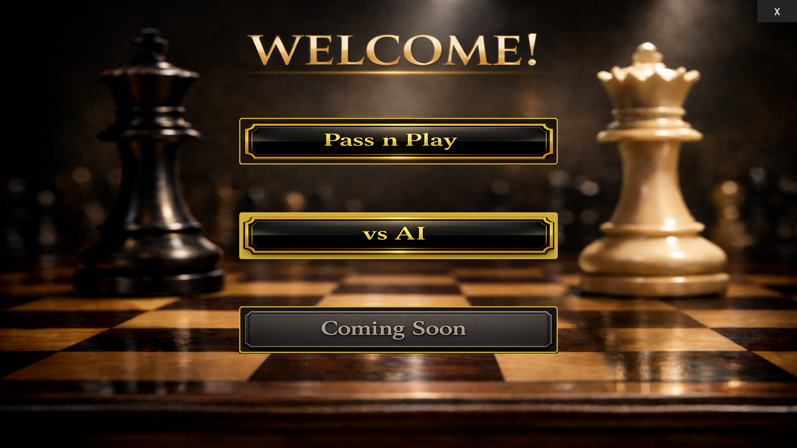
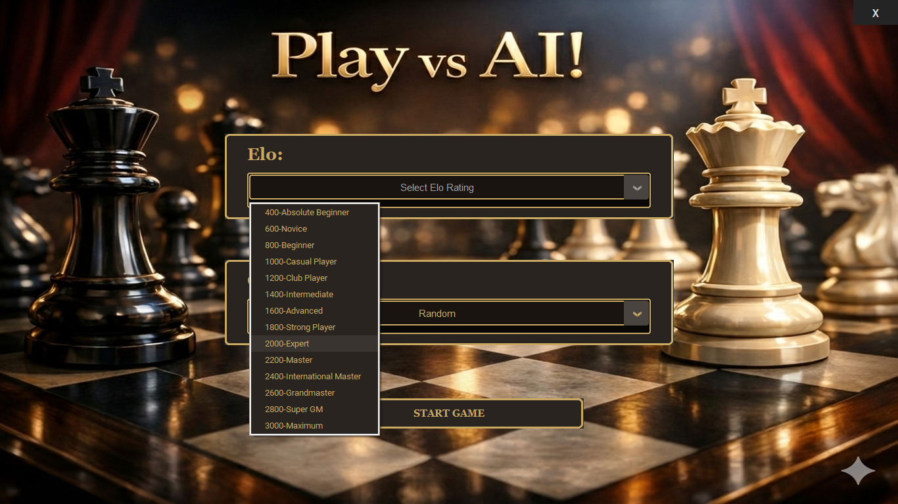
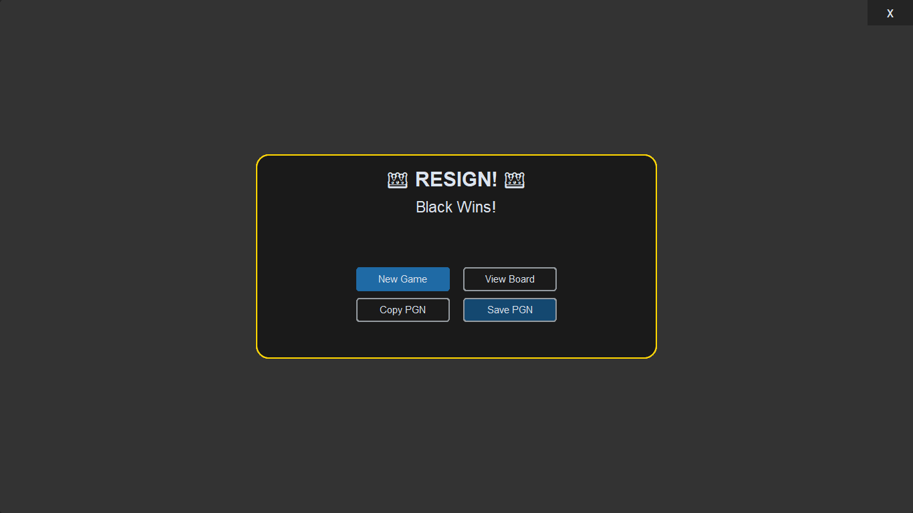
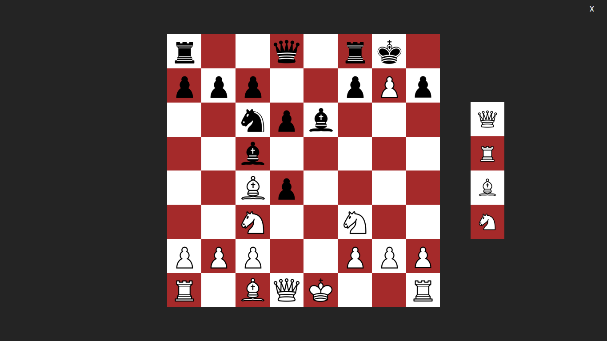

<div align="center">

# ♟️ Python Chess Game

### *A fully-featured chess implementation with AI opponent, beautiful UI, and complete rule validation*

[](https://www.python.org/)
[](LICENSE)
[](https://github.com/anurag-aryan-tech/Chess)
[](https://github.com/anurag-aryan-tech/Chess/releases)



[Features](#-features) • [Demo](#-demo) • [Installation](#-installation) • [How to Play](#-how-to-play) • [Architecture](#%EF%B8%8F-architecture) • [Roadmap](#%EF%B8%8F-roadmap)

</div>

---

## ✨ Features

<table>
<tr>
<td width="50%">

### 🤖 AI Opponent (NEW in v1.2)
Play against **Stockfish-powered AI** with 14 difficulty levels:
- **400-800 ELO**: Beginner (frequent mistakes)
- **1000-1400 ELO**: Intermediate (occasional blunders)
- **1600-2000 ELO**: Advanced (strong tactics)
- **2200+ ELO**: Master/Grandmaster level

</td>
<td width="50%">

### 🎯 Complete Chess Rules
All standard chess rules faithfully implemented:
- Full piece movement validation
- Turn-based gameplay with check detection
- Capture mechanics & special moves

</td>
</tr>
<tr>
<td width="50%">

### 🎨 Move Highlighting (NEW)
Visual feedback system:
- Last move highlighted in yellow
- Legal moves shown with dot indicators
- Highlights persist through board flips

</td>
<td width="50%">

### 🏁 Endgame Detection
Automatic detection and dialogs for:
- ✓ Checkmate
- ✓ Stalemate
- ✓ Resignation
- ✓ Check warnings

</td>
</tr>
<tr>
<td width="50%">

### 📋 PGN Support (NEW)
Full game notation features:
- Export games to PGN format
- Copy PGN to clipboard
- Standard headers and metadata
- Compatible with analysis tools

</td>
<td width="50%">

### ⚡ Special Moves
Full support for advanced mechanics:
- Castling (kingside & queenside)
- En passant captures
- Pawn promotion with UI selection
- Auto-promotion for AI moves

</td>
</tr>
<tr>
<td width="50%">

### 🔄 Dynamic Board Perspective
- Auto-flip after each move (Pass & Play)
- Manual flip button for analysis
- Always play from your perspective
- Smooth visual transitions

</td>
<td width="50%">

### 🎨 Customization
- 12 board color themes
- Medieval-themed UI
- Responsive design
- Fullscreen mode (ESC to toggle)

</td>
</tr>
</table>

---

## 🎥 Demo

<div align="center">

### Gameplay Preview

| 🎮 VS AI Mode | 🎯 Move Highlights | 👑 Pawn Promotion |
|:---:|:---:|:---:|
|  |  |  |

### Game Modes

| 🤖 Play vs AI | 👥 Pass & Play |
|:---:|:---:|
| Challenge 14 difficulty levels | Hot-seat multiplayer |

</div>

---

## 🚀 Installation

### Prerequisites

Before you begin, ensure you have:
- **Python 3.8+** installed ([Download here](https://www.python.org/downloads/))
- **pip** package manager

### Step-by-Step Setup

1️⃣ **Clone the repository**
```bash
git clone https://github.com/anurag-aryan-tech/Chess.git
cd Chess
```

2️⃣ **Install dependencies**
```bash
pip install customtkinter pillow numpy stockfish
```

3️⃣ **Download Stockfish Engine**
```bash
# Download from official site: https://stockfishchess.org/download/
# Place the executable in the stockfish/ directory
# Windows: stockfish-windows-x86-64-avx2.exe
# macOS: stockfish-macos (coming in v1.3)
# Linux: stockfish-linux (coming in v1.3)
```

4️⃣ **Run the game**
```bash
python chess.py
```

> 💡 **Tip:** For the best experience, run in fullscreen mode (press `ESC` after launching)

### Quick Install (All Dependencies)
```bash
pip install -r requirements.txt
```

**requirements.txt:**
```
customtkinter>=5.2.0
pillow>=10.0.0
numpy>=1.24.0
stockfish>=3.28.0
```

---

## 🎮 How to Play

### 🕹️ Controls

| Action | Control |
|--------|---------|
| Select a piece | Left click on piece |
| Move piece | Left click on highlighted square |
| Open settings | `S` key or ⚙️ button |
| Toggle fullscreen | `ESC` key |
| Resign game | 🏁 button |
| Flip board | 🔄 button |
| Close game | Click **×** button or `Alt+F4` |

### 🎯 Game Modes

#### 🤖 VS AI Mode
1. Select **VS AI** from the start menu
2. Choose your **ELO rating** (400-3000)
3. Pick your **color** (White, Black, or Random)
4. Click **START GAME**

**Recommended Difficulty:**
- **New to chess?** Start at 400-600 ELO
- **Know the rules?** Try 800-1000 ELO
- **Club player?** Challenge 1200-1600 ELO
- **Advanced?** Test yourself at 1800+ ELO

#### 👥 Pass & Play Mode
- Hot-seat multiplayer on one device
- Board auto-flips after each move
- Perfect for playing with friends locally

### ♟️ Special Moves Guide

<details>
<summary><b>🏰 Castling</b></summary>

**Requirements:**
- King and rook must not have moved
- No pieces between them
- King not in check, not moving through check, not into check

**How to Castle:**
1. Click your king
2. Click two squares toward the rook
3. King and rook move automatically

</details>

<details>
<summary><b>⚔️ En Passant</b></summary>

**Requirements:**
- Opponent's pawn just moved two squares forward
- Your pawn is on the 5th rank (for white) or 4th rank (for black)
- Must be captured immediately on next turn

**How to Capture:**
- Move your pawn diagonally to the square behind the opponent's pawn

</details>

<details>
<summary><b>👑 Pawn Promotion</b></summary>

**When it happens:**
- Your pawn reaches the opposite end of the board (8th rank for white, 1st rank for black)

**How to Promote:**
1. Move pawn to last rank
2. Select Queen, Rook, Bishop, or Knight from the side panel
3. Your pawn is replaced with the chosen piece

*Note: AI automatically promotes to Queen*

</details>

### 📋 Saving Your Games

After each game, you can:
- **Copy PGN** to clipboard for immediate use
- **Save to file** for future analysis
- Import PGN into chess analysis tools (Chess.com, Lichess)

### 📚 New to Chess?

Learn the complete rules at [Chess.com](https://www.chess.com/learn-how-to-play-chess)

---

## 🏗️ Architecture

### 📂 Project Structure

```
Chess/
│
├── chess.py              # 🎨 GUI & User Interaction Layer
├── utils.py              # 🧠 Chess Engine & AI Logic
├── database/
│   ├── database.py       # 💾 Game State Management
│   └── matrix.json       # 📊 Saved game data
├── stockfish/            # 🤖 AI Engine Binary
│   └── stockfish-windows-x86-64-avx2.exe
├── images/               # 🖼️ Chess piece assets
│   ├── white/
│   ├── black/
│   ├── start/
│   ├── vs_ai/
│   └── dot.png
├── PGNs/                 # 📋 Exported game files
└── screenshots/          # 📸 Documentation images
```

### 🔄 Data Flow

```
User Click → GUI (chess.py) → Validate Move (utils.py) → 
Update State (database.py) → Render UI → AI Response (if VS AI)
```

### 🎯 Core Components

| Component | Responsibility |
|-----------|----------------|
| **ChessGame** | UI rendering, event handling, game flow |
| **Utilities** | Legal move generation, notation, AI interface |
| **Database** | Centralized state management, move execution |
| **GameStateManager** | Atomic state transitions, move validation |
| **LegalMovesEngine** | Pin detection, check validation, move calculation |
| **AIUtilities** | Stockfish integration, difficulty management |

### 🎯 Design Principles

- **Centralized State**: Single source of truth via `GameStateManager`
- **Separation of Concerns**: UI, logic, and state cleanly separated
- **Atomic Updates**: All state changes happen in one transaction
- **Performance Optimized**: LRU caching, hash-based change detection, debounced redraws

---

## ⚙️ Technical Details

<details>
<summary><b>🛠️ Tech Stack</b></summary>

| Technology | Purpose | Version |
|------------|---------|---------|
| **Python** | Core programming language | 3.8+ |
| **CustomTkinter** | Modern, customizable GUI framework | 5.2.0+ |
| **NumPy** | Efficient 8×8 board matrix operations | 1.24.0+ |
| **Pillow (PIL)** | Image loading, processing, and scaling | 10.0.0+ |
| **Stockfish** | World's strongest chess engine | 16+ |
| **stockfish-python** | Python bindings for Stockfish | 3.28.0+ |

</details>

<details>
<summary><b>🧩 Key Implementations</b></summary>

**Chess Engine:**
- **Pin Detection Algorithm**: Identifies pieces blocking checks along rays
- **Legal Move Caching**: Hash-based validation to skip redundant calculations
- **Check Resolution Logic**: Calculates valid blocking/capturing moves
- **Castling Validation**: Real-time attack detection (no stale data)
- **FEN Notation Support**: Standard chess position representation

**AI System:**
- **Multi-PV Selection**: Considers top N moves, not just best
- **Weighted Randomness**: Simulates human decision patterns
- **Blunder Injection**: Configurable mistake rates per ELO level
- **Dynamic Thinking Times**: Difficulty-based delays (200-2000ms)
- **Real-time Statistics**: Tracks blunder percentage

**UI/UX:**
- **Move Highlighting**: Source and destination square visualization
- **Dynamic Image Sizing**: Responsive piece rendering with LRU cache
- **Debounced Resize**: Optimized window resize handling
- **Coordinate Conversion**: Seamless visual-to-logical mapping for flipped board

</details>

<details>
<summary><b>📐 Design Patterns</b></summary>

- **Singleton Pattern**: Centralized `database` instance for game state
- **State Pattern**: `GameStateManager` for atomic move execution
- **Strategy Pattern**: Different move generators for each piece type
- **Factory Pattern**: AI configuration creation based on ELO
- **Observer Pattern**: UI updates based on state changes
- **Dataclass Pattern**: Type-safe state representation (`MoveResult`, `StockfishConfig`)
- **Debouncing**: Optimized window resize handling

</details>

<details>
<summary><b>🎮 AI Difficulty System</b></summary>

**How It Works:**
1. **Multi-PV Engine**: Stockfish returns top N moves (not just best)
2. **Weighted Selection**: Randomly pick from candidates using configured weights
3. **Blunder System**: Occasionally pick from bottom 50% of moves
4. **Depth Control**: Lower ELO = shallower search = weaker play

**Example (1000 ELO):**
- Top 5 moves considered: [best, 2nd, 3rd, 4th, 5th]
- Weights: [50%, 25%, 15%, 7%, 3%]
- 10% chance to blunder (random bad move)
- Result: Plays like a ~1000 rated human

</details>

---

## 🗺️ Roadmap

### 🎯 Completed Features (v1.2)

- [x] AI opponent with 14 difficulty levels (400-3000 ELO)
- [x] Move highlighting (source and destination)
- [x] PGN export and clipboard copy
- [x] Board flip per move (Pass & Play)
- [x] Custom board themes (12 color combinations)
- [x] Resign functionality
- [x] Settings overlay
- [x] Game mode selection (VS AI / Pass & Play)
- [x] Centralized state management
- [x] Console logging system

### 📋 Planned for v1.3

| Feature | Priority | Status |
|---------|----------|--------|
| Move history panel with notation | High | 🔜 Next |
| Undo/Redo functionality | High | 🔜 Next |
| Position evaluation bar | High | Planned |
| Time controls (Blitz/Rapid/Classical) | Medium | Planned |
| Sound effects (moves, captures, check) | Medium | Planned |
| Hint system (show best move) | Medium | Planned |
| macOS/Linux Stockfish support | High | Planned |

### 🔮 Future Versions

| Feature | Target Version |
|---------|----------------|
| Opening book integration | v1.4 |
| Analysis mode (review games) | v1.5 |
| Endgame tablebase | v1.5 |
| Online multiplayer | v2.0 |
| Tournament mode | v2.0 |
| Puzzle trainer | v2.5 |

> 💡 Have an idea? [Open an issue](https://github.com/anurag-aryan-tech/Chess/issues) to suggest features!

---

## 📊 Version History

### v1.2-Stable (Current) - February 19, 2026
🤖 **AI Opponent Release**
- Added Stockfish-powered AI with 14 difficulty levels
- Move highlighting system
- Full PGN export support
- Centralized state management
- [View full release notes](https://github.com/anurag-aryan-tech/Chess/releases/tag/v1.2-stable)

### v1.1-Stable - February 8, 2026
🎨 **Customization & UX Update**
- Board auto-flip feature
- Settings menu with color themes
- Resign functionality
- Manual flip button
- [View full release notes](https://github.com/anurag-aryan-tech/Chess/releases/tag/v1.1-stable)

### v1.0-Stable - February 1, 2026
♟️ **Initial Release**
- Complete chess rule implementation
- Pass & Play mode
- Legal move validation
- Special moves (castling, en passant, promotion)

---

## 🤝 Contributing

Contributions make the open-source community an amazing place to learn and create. Any contributions you make are **greatly appreciated**! 🎉

### How to Contribute

1. 🍴 Fork the project
2. 🌿 Create your feature branch (`git checkout -b feature/AmazingFeature`)
3. ✅ Commit your changes (`git commit -m 'Add some AmazingFeature'`)
4. 📤 Push to the branch (`git push origin feature/AmazingFeature`)
5. 🔃 Open a Pull Request

### Contribution Guidelines

- ✍️ Follow existing code style and type hint conventions
- 📝 Write clear, descriptive commit messages
- 🧪 Test your changes thoroughly (all ELO levels for AI changes)
- 📚 Update documentation if adding features
- 🐛 Report bugs via [GitHub Issues](https://github.com/anurag-aryan-tech/Chess/issues)
- 💡 Discuss major changes in an issue before implementing

### Areas We Need Help With

- 🍎 macOS Stockfish integration
- 🐧 Linux Stockfish integration
- 🎨 UI/UX improvements
- 📱 Mobile-friendly interface
- 🌍 Internationalization (i18n)
- 📊 Advanced analytics features

---

## 🐛 Known Issues

- Stockfish binary is Windows-only in v1.2 (macOS/Linux support coming in v1.3)
- AI thinking time has no visual progress indicator
- Cannot adjust AI difficulty mid-game
- No undo/redo in current version

[View all open issues](https://github.com/anurag-aryan-tech/Chess/issues)

---

## 📄 License

This project is licensed under the **MIT License** - see the [LICENSE](LICENSE) file for details.

```
MIT License - Copyright (c) 2026
Permission is hereby granted, free of charge, to any person obtaining a copy
of this software and associated documentation files (the "Software"), to deal
in the Software without restriction, including without limitation the rights
to use, copy, modify, merge, publish, distribute, sublicense, and/or sell
copies of the Software...
```

---

## 🙏 Acknowledgments

Special thanks to:

- 🤖 **[Stockfish Team](https://stockfishchess.org/)** - For the world's strongest open-source chess engine
- 🎨 **[CustomTkinter](https://github.com/TomSchimansky/CustomTkinter)** - For the beautiful, modern UI toolkit
- 🔢 **[NumPy](https://numpy.org/)** - For efficient numerical computations
- 🖼️ **[Pillow](https://python-pillow.org/)** - For robust image processing
- 🐍 **[stockfish-python](https://github.com/zhelyabuzhsky/stockfish)** - For Python bindings
- ♟️ **The Chess Programming Community** - For algorithms and inspiration
- 🎭 **Chess Piece Artists** - For the elegant piece designs
- 🧪 **Beta Testers** - For bug reports and difficulty calibration feedback

---

## 📈 Statistics

**Project Metrics (v1.2):**
- 📝 **2,230+ lines of code** across 3 core files
- 🏗️ **14 pre-tuned AI configurations**
- 🎯 **400-3000 ELO range** (beginner to super-GM)
- 🎨 **12 board color themes**
- ⚡ **~100ms move calculation** (average)
- 📊 **Type hints throughout** for code quality

---

<div align="center">

### ⭐ Star this repository if you found it helpful!

**Made with ♟️, 🤖, and Python**

[🐛 Report Bug](https://github.com/anurag-aryan-tech/Chess/issues) • [✨ Request Feature](https://github.com/anurag-aryan-tech/Chess/issues) • [📚 View Releases](https://github.com/anurag-aryan-tech/Chess/releases)

---

### 📺 Watch Development Progress

[](https://github.com/anurag-aryan-tech/Chess)
[](https://github.com/anurag-aryan-tech/Chess/fork)
[](https://github.com/anurag-aryan-tech/Chess)

*"From beginner blunders to grandmaster brilliance – experience the full spectrum of chess."* 🏆

</div>